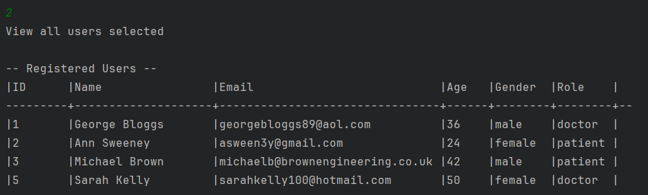

# Hospital Management System (Java, SQL)

A simple management system designed to create and manage patients and doctors, using a database set up in MySQL.

---

# Program Features

- **Create user** - Allows user to register a user into the database as a patient or doctor
- **View all users** - Retrieves database, listing all users
- **View all patients/doctors** - Specifically lists all relevant users under either role
- **View by ID** - Retrieve a specific user by their unique ID
- **Remove user by ID** - Remove a user from the database using their unique ID

---

# Software/Tools Used

- **Languages** - Java, SQL
- **IDE** - IntelliJ IDEA
- **Database** - MySQL
- **Build Tool** - Maven

---

# Table SQL Code

>[!IMPORTANT]
> The sql statement to create the table is found in the project files under "createtable.sql"
